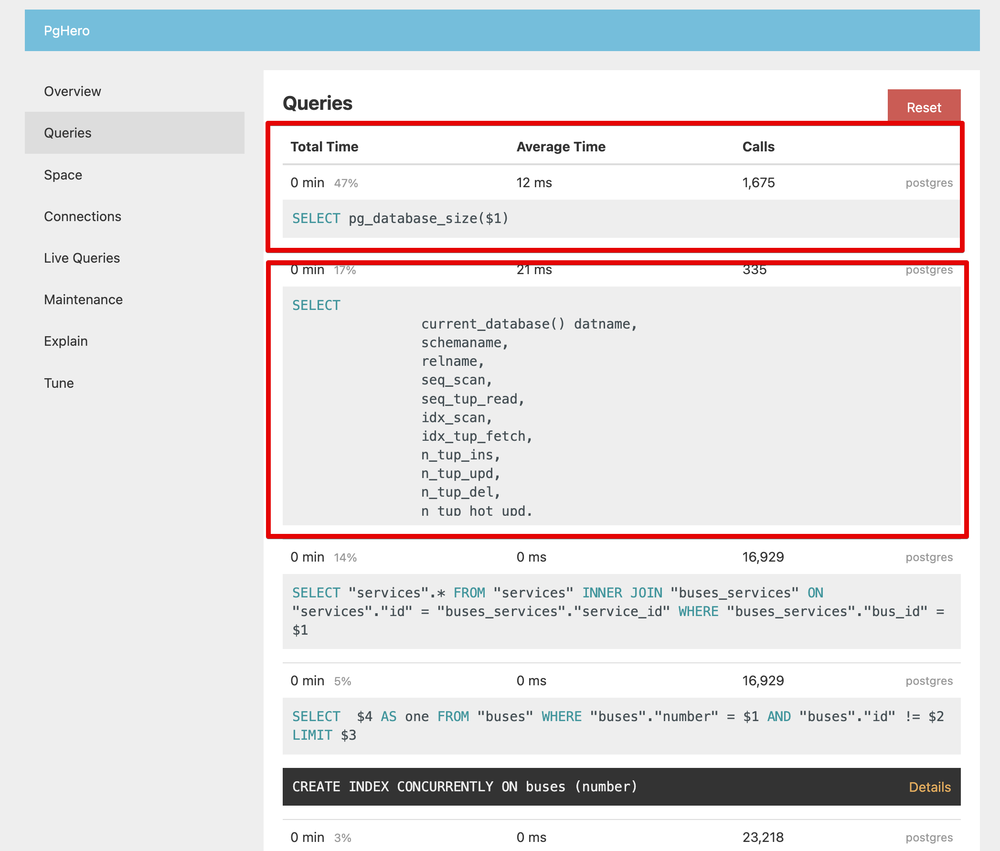

# Case-study оптимизации 1


- [Case-study оптимизации 1](#case-study-оптимизации-1)
  - [Актуальная проблема](#актуальная-проблема)
  - [Формирование метрики](#формирование-метрики)
  - [Feedback-Loop](#feedback-loop)
  - [Знакомство с инструментами и анализ](#знакомство-с-инструментами-и-анализ)
    - [RubyProf и гипотеза с CPU-intensive](#rubyprof-и-гипотеза-с-cpu-intensive)
    - [Установим и запустим pg\_hero](#установим-и-запустим-pg_hero)
    - [Установим и соберем связку prometheus+grafana+postgres\_exporter с помощью docker-compose](#установим-и-соберем-связку-prometheusgrafanapostgres_exporter-с-помощью-docker-compose)
    - [Сгенерируем отчет с помощью pg\_badger](#сгенерируем-отчет-с-помощью-pg_badger)
    - [Отказ от преждевременной оптимизации](#отказ-от-преждевременной-оптимизации)
    - [Оптимизация 1: индексы](#оптимизация-1-индексы)
    - [Оптимизация 2: activerecord-import и потоковый подоход](#оптимизация-2-activerecord-import-и-потоковый-подоход)
    - [Оптимизация 2: попробуем обновить Rails и Ruby](#оптимизация-2-попробуем-обновить-rails-и-ruby)
    - [Оптимизация 3: предзагрузим Services](#оптимизация-3-предзагрузим-services)
    - [Итоги](#итоги)
  - [Анализ работы самого приложения](#анализ-работы-самого-приложения)
    - [Оптимизация 1: N+1](#оптимизация-1-n1)
    - [Оптимизация 2: Индексы](#оптимизация-2-индексы)
  - [Вопросы](#вопросы)
  - [Action Items](#action-items)


## Актуальная проблема
Помимо старой версии ruby и гемов (прощай, Gemfile.lock) и танцев с контейнером Docker для Postgres (привет docker-compose.yml), на первый взгляд проблем обнаружено не было- 12 секунд на загрузку 1000 записей.
Попробуем загрузить 10_000 записей и видим время работы программы уже 90 секунд.

## Формирование метрики
Исходя из этих двух значений, могу предположить, что зависимость как минимум линейная, т.е. при загрузке 100_000 записей время составит уже 15 минут. Считаю текущее значение метрики неприемлемым, ставлю целевой бюджет на загрузку файла размером 100_000 строк в пределах минуты. (Ну вот опять же, сложно не разобравшись с кодом ставить такой бюджет вслепую)

## Feedback-Loop
Поставлю библиотеку RSpec и напишу тест, покрывающий функционал rake-задачи "reload_json"
```ruby
require 'rails_helper'

describe "rake reload_json[fixtures/small.json]" do
  context 'performs 1000 lines under 12s' do
    it {
      expect {
        Rake::Task['reload_json'].invoke('fixtures/small.json')
      }.to perform_under(12).warmup(0).times

      expect(Trip.count).to eq(1000)
    }
  end
end
```
Получаем проверку функционала и времени работы, feedback-loop занимает 12 секунд

## Знакомство с инструментами и анализ

### RubyProf и гипотеза с CPU-intensive

Зададим себе первый вопрос, а может быть проблема в CPU-intensive задаче, может быть JSON.parse занимает у нас много времени?
Из отчетов ruby-prof вижу, что большую часть времени занимают
- PG::Connection#exec_prepared
- PG::Connection#exec_params
Похоже, что проблема все-таки в базе данных

### Установим и запустим pg_hero


Видим несколько предложений создать индексы, видим частые запросы по сервисам (кстати, по сервисам создать индекс не предлагается)

### Установим и соберем связку prometheus+grafana+postgres_exporter с помощью docker-compose

<div float="left">


</div>

### Сгенерируем отчет с помощью pg_badger

Вообще глаза разбегаются, сложно понять, куда смотреть, куча служебных запросов, которые бы вообще лучше проигнорировать, 65К строчек логов postgres только за 2 прогона small.json, сложно

### Отказ от преждевременной оптимизации

В первую очередь чешутся руки пойти и переписать самое начало импортера на какой-нибудь `truncate` или `connection.execute`, однако проверив данные по этим запросам можно увидеть, что они занимают меньше 0.1% от общего времени выполнения, таким образом они не являются главной точкой оптимизации и трогать их мы не будем

### Оптимизация 1: индексы

Воспользуюсь данными отчета Most frequent queries из pg_hero
- `SELECT "services".* FROM "services" WHERE "services"."name" = ? LIMIT ?;`
- `SELECT "cities".* FROM "cities" WHERE "cities"."name" = ? LIMIT ?;`
- `SELECT ? AS one FROM "buses" WHERE "buses"."number" = ? LIMIT ?;`

Выглядит так, как будто нам необходимо построить следующие индексы
- BTree on services.name
- BTree on cities.name
- BTree on buses.number

После создания индекса на buses.number получаем рост времени выполнения импорта с 10 до 17 секунд. Наверное, логично, потому что при записи приходится писать в индекс. Вот тебе и советы от pg_hero)) (возможно связано с включением логирования???)
После создания индексов на services.name вижу снижение времени с 17 до 15 секунд
После создания индексов на cities.name так же не вижу снижения времени выполнения

Считаю эксперимент с индексами неудачным, уверен, что позже они нам понадобятся, однако прямо сейчас попробуем отменить их и выключить режим отладки postgres

### Оптимизация 2: activerecord-import и потоковый подоход

Попробуем переписать код на потоковый подход
После переписывания с помощью потокового чтения файла с данными и обработки через батчи с помощью activerecord-importer получаем результат загрузки large.json за 147 секунд. Это слегка больше, чем наш бюджет, но в целом- терпимо
pg_hero вообще перестал показывать относящиеся к скрипту запросы в своем интерфейсе
Вообще подход "загрузить весь файл в память и обрабатывать его целиком" показывает чуть большую производительность по скорости (около 10%), но вот незадача, количество выделяемой памяти линейно растет, т.е. на миллионе строк есть шанс не уложиться в (теоретические) бюджеты по памяти
Таким образом стриминг подход показывает стабильные 90МБ против 272МБ на 100_000 поездках при предзагрузке

### Оптимизация 2: попробуем обновить Rails и Ruby

После обновления скорость выполнения такая же, 151 секунда на large.json

### Оптимизация 3: предзагрузим Services

Вообще pg_hero немного ожил, я увидел постоянные запросы к таблице services, предсоздал их заранее и передал в batch-процессор и О ЧУДО, обработка large.json стала занимать 70 секунд. Считаем, что бюджетно
Вообще, конечно, можно похожим образом поступить, например, с городами, но, если честно на эту часть уже ушло слишком много времени, поэтому делать этоо я конечно же буду


### Итоги

Закреплю метрику с помощью теста, который проверяет работу на 1000 маршрутах за менее 1 секунды. Можно так же было бы добавить тест на потребляемую память, но чет устал

## Анализ работы самого приложения

Медленной работы приложения эмпирическим путем я не наблюдаю (P.S. потому что накатил маленький файл с данными)

```ruby
Trip.group(:from_id, :to_id).order('count_id DESC').count(:id).first
```

### Оптимизация 1: N+1

Указанный запрос говорит мне, что самое большое количество маршрутов для комбинации городов составляет ~~7 штук~~ (P.S. накатил не тот файл с данными.)
Однако я поставил rails_panel и rack-mini-profiler, чтобы оценить количество запросов на странице
В rails_panel вижу много дублирующих запросов, попробую их оптимизировать

Для начала напишу тест на контроллер. Пробую написать красный тест с помощью "rspec-sqlimit", ~~но проблемка, он не считает запросы во вьюхах даже с включенной опцией render_view~~ все вранье, надо было просто нормально создавать пресеты. Проверил, работает нормально, закрепил поведение спеком

Поставлю гем 'bullet' и попробую завести его
Следуя рекомендациям в геме, добавлю `.preload(bus: [:services])` и вижу, что количество запросов уменьшилось

Вижу, что после того, как мы загрузили все @trips в контроллере, во вьюхе мы идем по вложенным объектам, что приводит к N+1
Оптимизируем это с помощью #preload

```ruby
  @trips = Trip.where(from: @from, to: @to).preload(bus: [:services]).order(:start_time)
```

### Оптимизация 2: Индексы

Ну, на десерт добавим индексов, хотя необходимости в этом в данном случае особо не вижу, за бюджет на 100К записях не вылезаем.
Обратимся к pg_hero
Добавляем индексы по предложением (исключение- таблица :trips, там предлагает добавить одинарный индекс, но сделаем по [:from_id, :to_id])
И ловим проблемку. Оказывается в файле импорта города мы создаем дубликаты по :name.
В нормальной ситуации пришлось бы делать сложную миграцию, чтобы исправлять текущие данные, но с учетом того, что задание учебное- я просто снесу все записи, создам индекс и перенакачу города
Пришлось вынести города на уровень выше в нашем скрипте, что может отрицательно отразиться на потреблении памяти, однако, учитывая нашу "инсайдерскую информацию", что их будет не более 100 штук- ничего страшного
Ловим еще одну ошибку, на :trips надо создать индекс с учетом автобуса. Переделываем, накатываем
Интересный момент, при загрузке среднего файла- количество созданных записей- не 10К, а 9995. По ходу дела у нас есть дубликаты. Проверим. Блин, 1 автобус может ходить 2 раза за день. Индекс на уникальность надо создавать с учетом времени отправления (или вообще не создавать)
Пофиксили, получили небольшой прирост к скорости, успех

## Вопросы

1) Такое ощущение, что выгрузка логов для pg_badger сильно замедляет работу, поэтому вопрос, а как в реальном проде обстоят дела с этим? Все логи собираются нонстопом и в нужный момент по нужной выборке запускается pg_badger? Влияет же на производительность, не?


2) Мы чет не затронули вопрос constraints, а проблема в том, что текущие миграции написаны без использования foreign_keys. Насколько я себе представляю, это прям плохая практика и FK использовать надо обязательно. Однако, в контексте производительности, FK не создают индексов сами по себе и вряд ли как-то ускоряют чтение-запись. Можешь прокомментировать?

3) В pg_hero можно как-то отключить мониторинг мусорных запросов?

4) pg_hero какой-то мутный (то показывает, то не показывает, то вмного служебных запросов), pg_badger- неудобный для дебага, консоль рельсы не работает для rake задач, new-relic для такого проекта как из пушки по воробьям, такая же проблема с prometheus+grafana, ruby-prof теряется в стеке рельсовых вызовов, а хочется что-то типа rails_profiler, только для отладки rake-скриптов в консоли. Есть какой-то компромисс между всем этим?

5) При наличии такого индекса не накатывается скрипт через copy from stdin, но по-быстрому я ничего не нагуглил, поэтому вопрос, а как так?
```ruby
# add_index :trips, [:from_id, :to_id, :bus_id, :start_time], unique: true, algorithm: :concurrently
```

## Action Items

*) не стоит бросаться писать индексы, если не знаешь предметной области
*) стоило поставить NewRelic, но я подсмотрел ДЗ4, поковыряюсь с ним там
*) "лучше сначала заполнить данными, потом накатить индекс"- такое утверждение встретил в материалах курса, а вот в ДЗ был кейс, что я бы поспорил, на самом деле
*) опасность операций над базой (индексы накатывал с disable_ddl_transaction, в итоге миграция показывала ошибку, но частично индекс накатывала и сама миграция отмечалась пройденной)
*) rack-mini-profiler - не оценил, но, возможно, будет возможность в ДЗ4
*) проигнорировал
  - strong_migrations gem
  - не использовал explain analyze и тулзы с визуализацией (потому что запросы простые и потому что хочется взять готовый запрос, а не генерировать вручную/подставлять вместо значков $1 какие-то данные)
  - не пришлось встретиться с другими индексами (gist, gin) и поработать с jsonb
