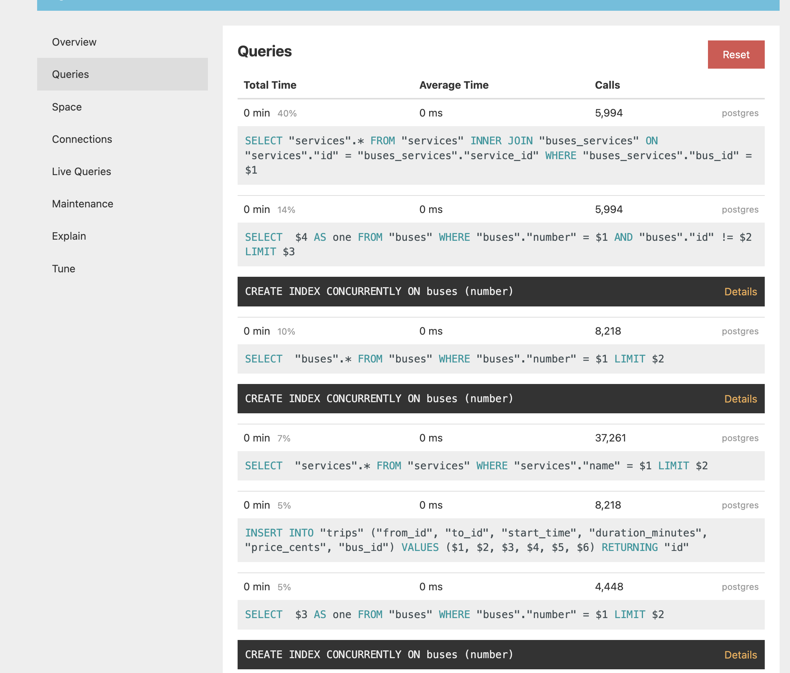

# Case-study оптимизации 1


## Актуальная проблема
Помимо старой версии ruby и гемов (прощай, Gemfile.lock) и танцев с контейнером Docker для Postgres (привет docker-compose.yml), на первый взгляд проблем обнаружено не было- 12 секунд на загрузку 1000 записей.
Попробуем загрузить 10_000 записей и видим время работы программы уже 90 секунд.

## Формирование метрики
Исходя из этих двух значений, могу предположить, что зависимость как минимум линейная, т.е. при загрузке 100_000 записей время составит уже 15 минут. Считаю текущее значение метрики неприемлемым, ставлю целевой бюджет на загрузку файла размером 100_000 строк в пределах минуты. (Ну вот опять же, сложно не разобравшись с кодом ставить такой бюджет вслепую)

## Feedback-Loop
Поставлю библиотеку RSpec и напишу тест, покрывающий функционал rake-задачи "reload_json"
```ruby
require 'rails_helper'

describe "rake reload_json[fixtures/small.json]" do
  context 'performs 1000 lines under 12s' do
    it {
      expect {
        Rake::Task['reload_json'].invoke('fixtures/small.json')
      }.to perform_under(12).warmup(0).times

      expect(Trip.count).to eq(1000)
    }
  end
end
```
Получаем проверку функционала и времени работы, feedback-loop занимает 12 секунд

## Оптимизация
Зададим себе первый вопрос, а может быть проблема в CPU-intensive задаче, может быть JSON.parse занимает у нас много времени?
Из отчетов ruby-prof вижу, что большую часть времени занимают
- PG::Connection#exec_prepared
- PG::Connection#exec_params
Похоже, что проблема все-таки в базе данных

Установим и запустим pg_hero


### Оптимизация 1